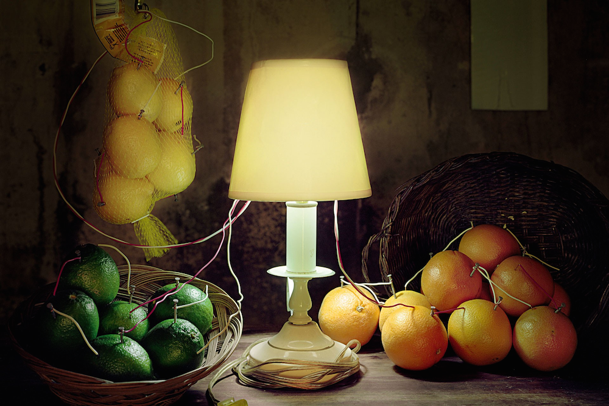
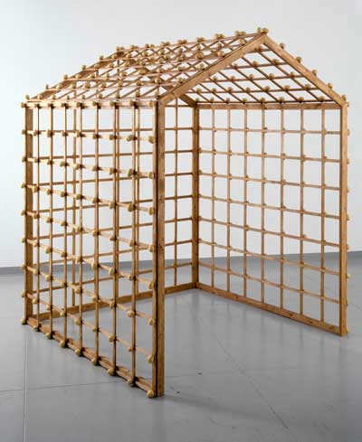

#Circuit Experiment

  
Caleb Charland, Fruit Battery Still Life (Citrus), 2012

  
Sigmar Polke, Object Kartoffelhaus (Potato House Object), 1967, courtesy Michael Werner Gallery, New York and Berlin

###Description
The purpose of this assignment is to integrate functional (electro-mechanical) and creative thinking. The project should incorporate an electrical circuit (or multiples), and at the same time should question and address the meaning of the prompt, "circuit."

Part of the circuit might be completed using an unusual material. Something you don't own or can't take with you, something you negotiate, or something strange: a piece of fruit? Don't be conservative, and don't be afraid to make something crazy.

The circuit should not be a short circuit, so it should have a load. The load, in this case, should function as an indicator of the circuit's completion. An LED will be fine if the rest of the circuit is sufficiently creative, but please feel free to think of other electrical components that can indicate a closed circuit.

This prompt is meant to be specific in some ways, to give you an idea about how to start, but try to end up somewhere totally unexpected. Ask yourself this question: How far can you stretch something before it breaks? Often, the breaking point is where things get interesting.

###Ideas to consider:

* Circuit as cycle, repetition, loop
* Other meanings of the word "circuit" -- for example, John Chamberlain's remark, at his residency at the RAND corporation for LACMA's 1968 Art and Technology project: "I can’t get into any of their circuits."
* what are the limits of the circuit? What is on the edge of circuit and non-circuit?
* bringing in external objects that complete circuits
* Browse the list of New Media [devices](../../wiki/devices) and see if any of them interest you.

###Materials to consider:

* circuit drawn using graphite or conductive tape <https://www.youtube.com/watch?v=BwKQ9Idq9FM>
* conductive thread
* Other conductors - lots of things conduct electricity -- anything made of metal conducts, plus many other materials. 
	- Playdough is sculptable and conductive: <http://www.qmod.qlabs.org/playdough-circuits/>. 
	- Graphite circuits on paper <https://www.youtube.com/watch?v=BwKQ9Idq9FM>
	- Saltwater conducts electricity very well, as do many things that contain water with a bit of salt. Even potatoes!

* Connectors: what connects the different components in your circuit? What you choose will depend heavily on what you're connecting.
* alternative power sources: <http://www.smithsonianmag.com/innovation/a-potato-battery-can-light-up-a-room-for-over-a-month-180948260/?no-ist>
* Take a trip to Home Depot and browse the materials and electrical supplies they have there. 

###Tips:
First: Don't be afraid to make something weird, something not everyone might understand at first (or at all!). This kind of object is usually much more intereresting than something obvious that you "get" right away. 

Second: don't think about what is and is not art - suspend that judgement. The point of this exercise is to experiment. But do put some thought into the materials and techniques you use -- you want it to be interesting for your classmates to look at and think about. Be prepared to talk about your choices. Materials often bring their own baggage into the conversation: for example, you can't make something out of play-dough and deny it has anything to do with children.

Third: not everything in your experiment has to be strictly functional! Interesting projects will spur a conversation between functional parts and non-functional parts.

###Helpful links:
Paper circuits with copper tape: <http://highlowtech.org/?p=2505>

###Grading
This is an experimental project: the process may be more important than the result. If you try hard but still can't make something you think is successful, make sure to document your efforts so that you can share them during critique. You'll receive full credit for this assignment if you can demonstrate curiosity, criticality, creativity, and effort!

